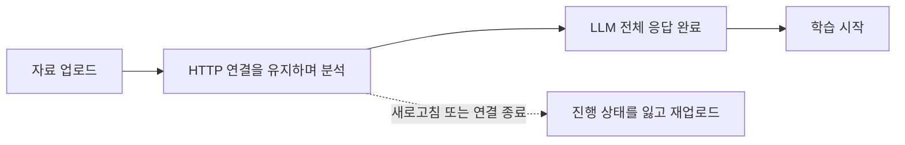
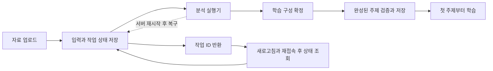

# LLM 학습 자료 분석의 대기 시간 개선

학습 자료를 업로드하면 AI가 내용을 분석해 학습 주제를 만듭니다. 기존 흐름에서는 **전체 분석이 끝날 때까지 학습을 시작할 수 없었고**, 분석 중 연결이 끊기면 자료를 다시 업로드해야 했습니다.

이 프로젝트는 분석 요청을 다시 찾을 수 있는 작업으로 저장하고, 학습 구성을 먼저 확정한 뒤 완성된 주제부터 제공해 두 문제를 해결했습니다.

## 핵심 결과

- 텍스트 학습 자료 3종의 비교에서 **첫 학습 주제 준비 시간이 평균 약 47% 단축**됐습니다.
- 새로고침하거나 재접속해도 작업 ID로 진행 상태와 결과를 다시 확인할 수 있게 했습니다.
- 서버가 재시작해도 저장된 입력과 작업 상태를 바탕으로 분석을 복구할 수 있게 했습니다.

## 개선 전후의 흐름

### 개선 전

사용자는 분석이 끝날 때까지 기다려야 했습니다. 분석 중 화면을 떠나면 이어서 확인할 작업 ID도 없었습니다.

### 개선 후

분석은 브라우저 연결과 별도로 진행됩니다. 사용자는 같은 작업을 다시 조회할 수 있고, 전체 분석이 끝나기 전에도 준비된 주제부터 학습할 수 있습니다.

## 1. 분석 요청을 영속 작업으로 전환

기존에는 업로드 요청을 처리하는 HTTP 연결이 LLM 분석 완료까지 기다렸습니다. 이 구조에서는 화면의 연결 상태와 실제 분석 진행을 분리하기 어려웠습니다.

개선 후에는 요청을 받으면 먼저 업로드 원본을 영속 저장소에 보관하고, DB에 작업 ID·사용자·입력 참조·상태를 기록합니다. 서버는 분석 결과 대신 작업 ID를 즉시 반환합니다. 별도 실행기가 대기 중인 작업을 가져와 LLM 분석을 수행하고, 완료 결과나 실패 상태를 같은 작업에 기록합니다.

브라우저는 작업 ID로 상태를 조회합니다. 페이지를 새로고침하거나 다시 접속해도 새 업로드를 시작할 필요 없이 기존 작업을 찾을 수 있습니다. 서버가 재시작하면 저장된 입력과 상태를 읽어 끝나지 않은 작업을 다시 실행합니다. 이때 이전 실행이 늦게 끝나더라도, **현재 작업을 맡은 실행자만 결과를 기록**하도록 해 복구된 결과가 덮어쓰이지 않게 했습니다.

## 2. 학습 구성을 고정하고 주제별로 공개

LLM 응답을 SSE로 받으면 첫 주제가 완성된 순간 바로 제공할 수 있습니다. 하지만 분석이 중간에 실패했을 때 새 응답을 처음부터 만들면 주제의 개수나 원문 배정이 달라질 수 있습니다. 앞서 제공한 주제를 그대로 두고 새 응답을 붙이면 같은 내용을 두 번 배우거나 일부 내용을 빠뜨릴 위험이 있습니다.

그래서 학습 내용을 만들기 전에 **어떤 원문을 어떤 주제가 담당할지** 먼저 정합니다. 예를 들어 원문 앞부분을 ‘프로세스’, 뒷부분을 ‘스케줄링’으로 나눴다면, 각 주제의 ID·제목·순서·담당 범위를 검증해 저장합니다. 원문 전체가 빠짐없이, 중복 없이 배정됐는지도 확인합니다.

이후 주제별 학습 내용을 받습니다. 주제 하나가 완성되면 저장된 구성과 일치하는지 검사하고, **저장이 끝난 뒤에만** 학습 가능하다고 알립니다. ‘프로세스’까지 제공한 뒤 연결이 끊겼다면, 이미 완성된 주제는 보존하고 ‘스케줄링’만 다시 생성합니다. 재시도 중에도 처음 확정한 범위와 순서는 바뀌지 않습니다.

## 측정 결과

측정한 시간은 분석 시작부터 **첫 번째 주제가 검증·저장되어 학습 가능해질 때까지**입니다. 텍스트 학습 자료 3종을 각각 3회 비교했으며, 표의 시간은 평균입니다.

| 학습 자료 | 기존 첫 학습 대기 | 개선 후 첫 학습 대기 | 감소율 | 개선 후 전체 완료 |
| --- | ---: | ---: | ---: | ---: |
| 운영체제 | 10.82초 | 6.93초 | 약 36% | 17.00초 |
| 네트워크 | 10.10초 | 5.95초 | 약 41% | 13.48초 |
| 첫 주제가 짧은 자료 | 11.65초 | 4.17초 | 약 64% | 14.68초 |

자료별 첫 대기 시간 감소율의 평균은 **약 47%**입니다. 전체 완료 시간은 별도로 기록했습니다. 이 결과는 첫 학습을 앞당긴 것이며, 전체 분석 속도가 빨라졌다는 뜻은 아닙니다. 측정에는 브라우저 업로드와 화면 전환 시간은 포함하지 않았습니다.
