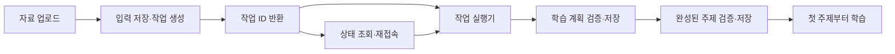

# LLM 학습 자료 분석: 첫 학습 대기와 작업 복구 개선

학습 자료를 업로드하면 AI가 내용을 분석해 학습 주제를 만드는 서비스에서, **첫 학습까지 오래 기다리는 문제**와 **분석 중 연결이 끊기면 다시 업로드해야 하는 문제**를 해결한 사례입니다.

## 결과

- 학습 자료 3종을 이용한 비교에서 **첫 학습 주제 준비 시간이 평균 약 47% 감소**했습니다. 자료별 감소 폭은 36~64%였습니다.
- 새로고침하거나 재접속해도 작업 ID로 진행 상태와 완료 결과를 다시 확인할 수 있게 했습니다.
- 서버 재시작 후에도 저장된 입력과 상태를 읽어 중단된 작업을 복구할 수 있게 했습니다.

## 문제와 접근

기존에는 LLM의 전체 응답이 끝나야 학습을 시작할 수 있었습니다. SSE로 응답을 받아 완성된 주제를 먼저 보여주면 기다리는 시간을 줄일 수 있지만, 호출이 중간에 실패했을 때 단순히 새 응답을 이어 붙일 수는 없습니다. LLM이 재시도마다 주제의 수와 범위를 다르게 생성할 수 있기 때문입니다.

또한 브라우저의 HTTP 연결이 분석 작업 자체를 대표하면, 연결이 끊겼을 때 사용자가 진행 상태를 되찾기 어렵습니다. 따라서 **작업 접수**, **LLM 실행**, **결과 조회**를 분리했습니다.



## 1. 분석 요청을 영속 작업으로 전환

업로드 요청은 입력을 영속 저장소에 보관하고 DB에 작업을 만든 뒤 `202 Accepted`와 작업 ID를 반환합니다. 실제 LLM 호출은 별도 실행기가 맡습니다. 클라이언트는 작업 ID로 `queued → running → done/failed` 상태를 조회합니다.

실행기는 DB에서 작업을 선점할 때 고유한 **claim token**을 받습니다. 결과 기록에도 같은 토큰을 요구합니다. 서버 재시작 후 작업을 다시 실행하더라도, 이전 실행의 늦은 응답은 새 실행의 결과를 덮어쓸 수 없습니다.

## 2. 학습 계획을 고정하고 주제별로 공개

LLM 응답은 `plan` 다음에 `details`가 오는 순서로 받습니다. 계획은 각 주제의 ID, 제목, 담당 원문 블록을 정의합니다. 원문 블록 전체가 순서대로 정확히 한 번 배정됐는지 확인하고, **첫 주제를 공개하기 전에 계획을 저장**합니다.

이후 SSE 텍스트 조각에서 주제 객체 하나가 완성될 때마다 다음 순서로 처리합니다.

1. 고정된 계획의 ID·제목·원문 범위와 일치하는지 검사합니다.
2. 완성된 주제를 저장합니다.
3. 저장이 끝난 주제만 학습 가능 상태로 알립니다.

응답이 끊기면 부분 생성 중이던 주제는 버립니다. 다음 호출에는 저장된 계획과 미완료 주제 목록만 전달합니다. 이미 공개한 주제는 그대로 두고, 남은 주제 전체를 다시 생성합니다. 이 방식은 재시도로 인한 **주제 범위의 중복·누락**을 막습니다.

## 측정

비교 기준은 전체 분석 완료 시간이 아니라, **첫 번째 주제가 검증·저장되어 학습 가능한 시점**입니다.

| 학습 자료 | 전체 결과를 기다린 경우 | 주제별 조기 공개 | 첫 대기 시간 감소 |
| --- | ---: | ---: | ---: |
| 운영체제 | 10.82초 | 6.93초 | 약 36% |
| 네트워크 | 10.10초 | 5.95초 | 약 41% |
| 첫 주제가 짧은 자료 | 11.65초 | 4.17초 | 약 64% |

세 자료의 감소율 평균은 약 47%입니다. 첫 학습을 앞당긴 결과이며, 전체 분석 완료 시간의 단축을 뜻하지는 않습니다.

## 코드 읽는 순서

| 파일 | 보여주는 설계 |
| --- | --- |
| [`schema.sql`](schema.sql), [`src/jobRepository.mjs`](src/jobRepository.mjs) | DB 작업 상태, 선점, claim token, 재시작 복구 |
| [`src/jobService.mjs`](src/jobService.mjs) | HTTP 요청 접수·조회와 LLM 실행의 분리 |
| [`src/planStreamScanner.mjs`](src/planStreamScanner.mjs) | 임의의 SSE 텍스트 조각에서 완성된 계획·주제 추출 |
| [`src/planValidation.mjs`](src/planValidation.mjs) | 계획의 원문 범위와 주제 근거 검증 |
| [`src/checkpointStore.mjs`](src/checkpointStore.mjs) | 계획과 완료 주제의 원자적 저장 |
| [`src/planFirstAnalysis.mjs`](src/planFirstAnalysis.mjs) | 실패 후 미완료 주제만 재개하는 핵심 흐름 |

이 저장소는 설계를 읽고 실행할 수 있도록 관련 코드를 추린 독립 예제입니다. 데모와 테스트는 모의 LLM 응답을 사용하며, 실제 학습 자료나 인증 정보는 포함하지 않습니다.

## 실행

Node.js 20 이상에서 별도 패키지 설치 없이 실행할 수 있습니다.

```bash
npm test
npm run demo
```

`demo`는 첫 주제를 저장한 뒤 스트림이 끊기고, 저장된 계획으로 두 번째 주제만 재생성하는 흐름을 출력합니다.
